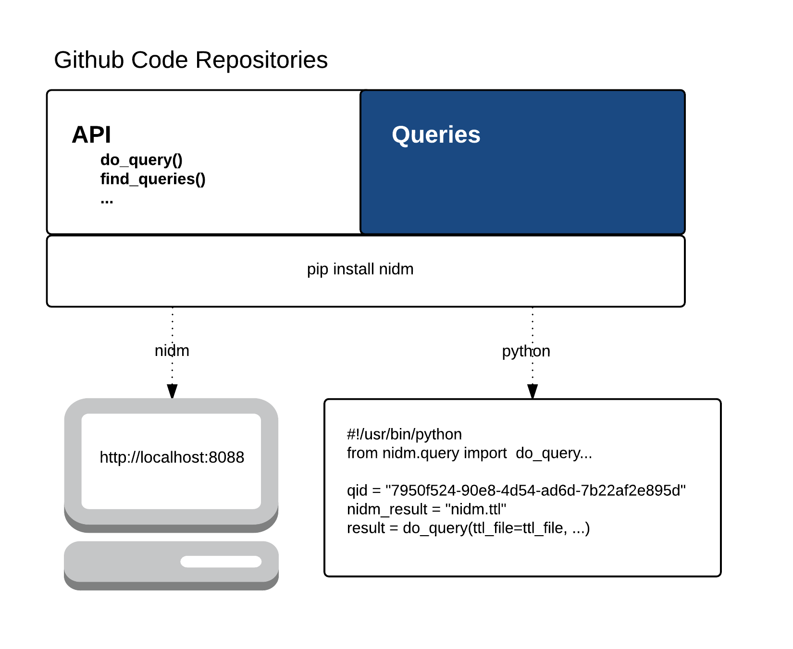
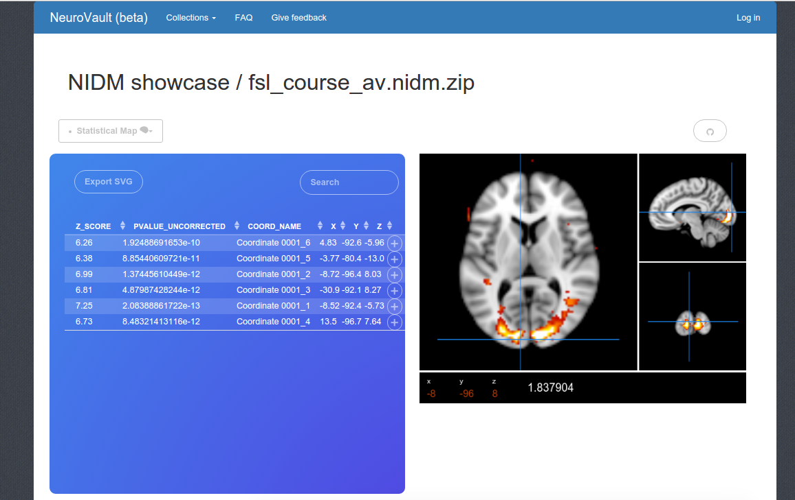

---
event: '2015 Brainhack Americas (MX)'

title:  'The Neuroimaging Data Model (NIDM) API'

author:

- initials: VS
  surname: Sochat
  firstname: Vanessa
  email: vsochat@stanford.edu
  affiliation: aff1
  corref: aff1
- initials: NN
  surname: Nichols
  firstname: B Nolan
  email: nolan.nichols@gmail.com
  affiliation: aff2,aff3

affiliations: 

- id: aff1
  orgname: 'Program in Biomedical Informatics, Stanford University'
  street: 1265 Welch Road
  postcode: 94306
  city: Stanford
  state: California
  country: USA
- id: aff2
  orgname: 'SRI International'
  street: 333 Ravenswood Ave
  postcode: 94025
  city: Menlo Park
  state: California
  country: USA
- id: aff1
  orgname: 'Department of Psychiatry and Behavioral Sciences, Stanford University'
  street: 1265 Welch Road
  postcode: 94306
  city: Stanford
  state: California
  country: USA
  
url: http://nidm-api.readthedocs.org. Further data and files supporting this project are hosted in the *INCF NIDASH* repositories https://github.com/incf-nidash/nidm-api and https://github.com/incf-nidash/nidm-query.

coi: None

acknow: The authors would like to thank the INCF Neuroimaging Data Sharing Task Force, organizers and attendees of Brainhack MX, along with David Keator for helpful edits to the manuscript. VS is supported by a William R. Hewlett Stanford Graduate Fellowship and a National Science Foundation Fellowship. NN is supported by NIH NIAAA and OD (NCANDA Data Analysis Component, NIH 1 U01 AA021697; BD2K Supplement, NIH 1 U01 AA021697-04S1).

contrib: VS and NN wrote the software and wrote the report.
  
bibliography: brainhack-report

gigascience-ref: \href{http://gigadb.org/dataset/100236}{doi:10.5524/100236}
...

#Introduction
Sharing of brain research can be aided by the Neuroimaging Data Model (NIDM) \cite{Keator2013-rc} \cite{noauthor_undated-jz} \cite{noauthor_undated-pr}. NIDM provides a community-based framework for developing data exchange standards that describe the primary observations, computational workflows, and derived results of neuroimaging studies \cite{noauthor_undated-jv}. For example, a researcher sharing a statistical brain map could include with the brain map a data structure, "NIDM Results", that contains complete information about the parameters used to generate the result, significant coordinate points in the brain map paired with test criteria, along with other meta-data exported from the software that generated it. This additional information cannot be represented in the brain map itself, and provides a complete description of the result that can be compared to other results, or used to reproduce it. 

While work is underway to integrate NIDM into the software used by the human brain mapping community, only low-level tools are currently available to access and query NIDM documents that rely on a graph-based representation called the Resource Description Framework (RDF) \cite{noauthor_undated-hj}. Further, technologies like RDF and the corresponding query language, SPARQL \cite{noauthor_undated-cp}, pose a steep learning curve for users of standard Web development workflows. With the recent migration of tools for neuroimaging meta analysis \cite{Yarkoni2011-rg} \cite{Reid2015-gt}, sharing \cite{Crawford2016-zl} \cite{Landis2016-wo} \cite{Book2016-ro} \cite{Herrick2016-bw} \cite{Hodge2016-ht} \cite{Jernigan2016-dz} \cite{Kini2016-sg} \cite{Wang2016-nd} \cite{Gorgolewski2015-sf}, and visualization \cite{Gutman2014-hz} \cite{Gao2015-pz} \cite{noauthor_undated-ca} into the Web browser, Web developers will be incentivized by the ability to easily integrate brain data into Web applications using familiar languages and formats. The goal of this Brainhack project was to develop infrastructure to serve NIDM documents and queries using an API with a syntax that allows for the easy development of Web-based tools for the neuroimaging community. These tools are publicly available on Github (RRID:SCR\_002630) at [https://github.com/incf-nidash/nidm-api](https://github.com/incf-nidash/nidm-api) and [https://github.com/incf-nidash/nidm-query](https://github.com/incf-nidash/nidm-query) for the API and queries, respectfully, along with complete documentation at [https://nidm-api.readthedocs.org](https://nidm-api.readthedocs.org).

#Approach
The \texttt{nidm-api} \cite{noauthor_undated-hq} is a RESTful API and Web application that provides a simplified view of NIDM documents using formats (e.g., JavaScript Object Notation (JSON) \cite{Wikipedia_contributors2015-on} \cit{noauthor_undated-tz}) that are accessible to Web developers and researchers without expertise in Linked Open Data (LOD) technologies. This project includes two components. First, the [`nidm-api`](https://github.com/incf-nidash/nidm-api) is a Python-based executable that works both as a command-line tool to run queries over NIDM documents, as well as to serve a RESTful API to allow a local or cloud-based server to execute queries on documents accessible by URL. Second, [`nidm-query`](https://github.com/incf-nidash/nidm-query) is a repository of SPARQL queries that the \texttt{nidm-api} application dynamically downloads, validates, and serves upon starting the application. This strategy means that NIDM developers can collaboratively construct SPARQL queries without requiring Web developers to gain expertise in LOD technology. The \texttt{nidm-api}, along with serving the queries, also provides a graphical Web interfaces to contribute new queries to the shared repository. Because the \texttt{nidm-api} is a Python Flask \cite{noauthor_undated-ia} application, it can be used both as an executable to serve the API \cite{noauthor_undated-ii}, and contains a set of functions that can be integrated into other Python-based frameworks \cite{noauthor_undated-ej} or cloud platforms that provide Python accessibility \cite{noauthor_undated-jw} \cite{Google_undated-aj}. A schematic of the tool is provided in (Figure 1).

#Results

##Using the API
Installation produces an executable, *nidm* that downloads, validates, and provides a summary of available queries in the \texttt{nidm-query} repository. A query can be further investigated by selecting its unique identifier:

**http://localhost:8088/api/7950f524-90e8-4d54-ad6d-7b22af2e895d**

and can then be executed in a RESTful fashion by including a variable to point to a local path or URL of a NIDM document:

**http://localhost:8088/api/query/7950f524-90e 8-4d54-ad6d-7b22af2e895d?ttl=/home/nidm.ttl**

The API then runs the query over the document, and returns the result to the user in JSON. The same functionality can be achieved on the [command line](http://nidm-api.readthedocs.org/en/latest/getting-started.html#integration-into-python), supporting direct integration into server-based Python applications.

##Generating new queries
Researchers familiar with LOD can run the application in the same fashion, and go to a URL in their local browser:

\textbf{http://localhost:8088/query/new}

which reveals [an interface](http://nidm-api.readthedocs.org/en/latest/development.html#web-query-generator) to generate new queries. The web interface asks for a set of [variables](http://nidm-api.readthedocs.org/en/latest/development.html#fields) that are necessary for the \texttt{nidm-api} to serve the query. The query can be previewed, and then downloaded as a JSON object that can be submitted to the \texttt{nidm-query} repository and added to the application.\newline

##Applications using NIDM
As an example of the type of Web applications that can be built with the NIDM API, the NIDM Results object model \cite{noauthor_undated-if} was recently integrated into the [NeuroVault](http://www.neurovault.org) database, meaning that neuroimaging researchers can export results pertaining to statistical brain maps from common software \cite{Jenkinson2012-pr} into NeuroVault. A [nidm-viewer](https://github.com/vsoch/nidmviewer) ([https://github.com/vsoch/nidmviewer](https://github.com/vsoch/nidmviewer)) that runs queries over the nidm-results can then parse the coordinates and statistical parameters associated with significant locations of activations to be rendered in a table alongside a visualization of the brain map itself (Figure 2 and [example](http://neurovault.org/collections/877/fsl_course_av.nidm)). The raw data and parameters of the analysis are thus immediately available for sharing and publication, programatically accessible, and viewed from any web browser. 

# Conclusions

By providing tools to integrate the NIDM standard into modern web technology, NIDM can be more easily deployed into applications to empower neuroimaging researchers to explore and synthesize results, workflows, and experiments. This application will be extended to return more modern and desired outputs such as images and interactive graphs \cite{noauthor_undated-fs}, and additional functionality will be added as the NIDM experiment, workflows, and results standards are further developed. The software and queries are both [publicly available](https://github.com/incf-nidash) and open to contributions.
